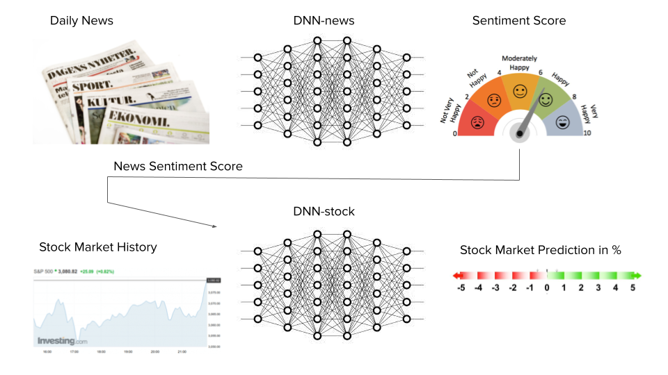

# scalableMLproject
Project in Advanced Scalable Machine Learning Course at KTH

* Predict: stock market
* Data sources: 
- News sentiment in English: https://archive.ics.uci.edu/ml/datasets/News+Popularity+in+Multiple+Social+Media+Platforms
- News headlines: https://newsapi.org/docs/endpoints/top-headlines
- Nasdaq stock market: https://data.nasdaq.com/tools/python 
	- Reference: https://github.com/Nasdaq/data-link-python 
- Competitors: https://finnhub.io/ 
* Group number: 26

* Option1: Training data columns: stock price for one company? "Tesla" - news sentiment score focusing on news related to "Tesla"  
* Option2: Training data columns: stock price for index - news sentiment score 



## ToDO

* Xin&Ludvig: Try to get historical data for news, e.g. from News headlines or elsewhere!
* Ludvig: Try to get API for new news headlines (see link above) - make sure correct news articles/country
* Xin: Try to get API stock market index from the nasdaq link above

## Literature

* https://www.projectpro.io/article/stock-price-prediction-using-machine-learning-project/571 
* https://stocksnips.net/learn/news-based-stock-sentiment/ 
* https://towardsdatascience.com/sentiment-analysis-on-news-headlines-classic-supervised-learning-vs-deep-learning-approach-831ac698e276 

## Tutorials

* https://github.com/logicalclocks/hopsworks-tutorials/tree/master/advanced_tutorials
* In particular, this one: https://github.com/logicalclocks/hopsworks-tutorials/tree/master/advanced_tutorials/bitcoin 
* https://github.com/featurestoreorg/serverless-ml-course

## Notes

* Need to create API keys/secrets at modal. Create all API keys in same secret
* Backfill feature pipeline gets historical data
* Wait_for_job=False recommendation from Jim when it comes to uploading to feature group?
* Add some great_expectations or something that looks at the data and disregards it if it is not what you expected

This is Xin's branch!! 


# Draft for the Readme.md of the ScalableML Project

For this project, we apply the relavant `time-series features` for training a `Long short-term memory (LSTM) Recurrent Neural Network model`, which serves for predicting the closing stock price of Tesla, Inc. (TSLA) in the following business day. Our LSTM model is further deployed online with the `Modal Stub` service, which enables an automatic daily performance of the prediction of the TSLA stock price.

The workflow of this project can be factorised into the following pipelines:
* **feature pipeline** which excutes feature engineering with `Hopsworks` online feature store, 
* **training pipeline** with Bayesian optimization-based hyperparameter tuning, and, 
* **batch-inference pipeline** which extracts newly updated stock market and news sentiment information, and perform a stock price prediction for the coming business day.

Finally the results of our TSLA stock price prediction is communicated to the interested readers with a **user interface** hosted at the `Huggingface space`: https://huggingface.co/spaces/LudvigDoeser/TSLA_stock_predictions

## Feature pipelines
The raw data for our stock price prediction project consists mainly of the following two parts:
* the **historical TSLA stock prices**, and 
* the **News Sentiment data** about Tesla, Inc., 

tracing from 2015-07-16 to 2023-01-10.

The historical stock price data are obtained with the `yfinance` package, which utilizes the `Yahoo! Finance API` to access the real-time market data containing the opening price, highest/lowest value, closing price, and the volume of a variety of stocks in the financial markets. The **closing price data** of TSLA stock is normalized with the transformation function `min_max_scaler` available in `Hopsworks`, and stored together with the corresponding datetime into one feature group. 

We have implemented tests by including more types of feature values in the training data, e.g., combining the closing price data with opening price, highest/lowest price, and volume data together, but found that employing only the `closing price` in the feature view could give a **smallest root-mean-squre error (RMSE)** for the trained LSTM model. Therefore we select only the closing price in our feature group based on this **offline experimentation**.

The News sentiment dataset is acquired from the `Sentiment Data Financial API` supported by EOD Historical Data, Unicorn Data Services. This dataset provides us with financial news sentiment analysis results on TSLA, which contains the date, title, specific content and link to each relevant report, together with a sentiment score for each piece of news. The news sentiment score is obtained by detection of positive and negative mentions inside one report, and normalizing them to a polarity value with scale [-1,1]. For example, a polarity value equals -1 indicates a completely negagive report, whereas +0.1 suggests a slight preference with positive attitude. The `Sentiment Data Financial API` updates sentiment scores on a daily basis, by aggregating the news reports on the stocks of interest.

Specifically, we take the 7-day **exponential moving avarage** of the news sentiment scores of TSLA as one feature group. The exponential moving average is given by the formula

$$ y_t = {x_t+(1-\alpha)x_{t-1}+(1-\alpha)^2 x_{t-2}+\cdots+ (1-\alpha)^n x_{t-n} \over 1+(1-\alpha)+(1-\alpha)^2+\cdots+(1-\alpha)^n} $$

where $x_t$ denotes the daily observed sentiment score values, $y_t$ denotes the desired exponential moving average, $n=7$ in our case correpsonds to a 7-day time-window for exponential smoothing, and $\alpha = 2/(n+1) = 0.25 \in (0,1)$ is the smoothing factor. We may simply understand that the exponential moving average is applied to **give a greater weight and significance on the most recent sentiment score data**. We have also tested using $n=20$ days as the smoothing time-window, and observed similar results with using $n=7$, which validates our current choice with 7-day exponential smooothing.

After extracting the relevant information from the two raw datasets, we upload the corresponding two feature groups containing (normalized) historical stock data and (smoothed) news sentiment score data respectively, to the `Hopsworks feature store`. Then these two feature groups are merged with the column **date** as the primary key to provide us with the online-embedded feature view. In order to match the two feature groups, we only select the rows corresponding to business days from the news sentiment feature group, where the TSLA stock are traded and a closing price is available.

## Training Pipeline
Specifically for each business day, our training dataset contains the previous closing prices of the past 7 business days and the 7-day exponential moving average of the news sentiment score values.

### (1). Offline experimentation and Training of the LSTM model
For the training of our LSTM Recurrent Neural Network model, we apply a Bayesian optimization-based search for the setting of hyperparameters, with the help of the `KerasTuner` tool. Specifically we use 0.1 for the validation split ratio and 256 for the batch size. The hyperparameter values of the three best trials which returns the smallest RMSE values are summarized in the following table.
| RMSE | No. filters | dropout rate | recurrent_dropout | dense_dropout | depth | activation function |
| --- | --- | --- | --- | --- | --- | --- |
| 0.00125 | 128 | 0.01 | 0.1 | 0.01 | 1 | leaky-relu |
| 0.00134 | 128 | 0.01 | 0.3 | 0.01 | 1 | leaky-relu |
| 0.00138 | 128 | 0.01 | 0.01 | 0.01 | 1 | leaky-relu |

One example of our training and validation error for the best hyperparameter setting in the above table are plotted as follows.


Finally, we end up using a model that was trained for 179 epochs, with validation split ratio of 0.1 (with different random seed value from the hyperparameter tuning) and applying early stopping. The training of our model utilizes all the accessible data to January 4th of 2023. One sample code for our training with `adam` optimization is given as the following `create_model` function.

```python
def create_model(LSTM_filters=64,
                 dropout=0.1,
                 recurrent_dropout=0.1,
                 dense_dropout=0.5,
                 activation='relu',
                 depth=1,
                 input_channels=1):

    model = Sequential()
    
    if depth>1:
        for i in range(1,depth):
            # Recurrent layer
            model.add(LSTM(LSTM_filters, return_sequences=True, dropout=dropout, recurrent_dropout=recurrent_dropout,input_shape=(timelag, input_channels)))

    # Recurrent layer
    model.add(LSTM(LSTM_filters, return_sequences=False, dropout=dropout, recurrent_dropout=recurrent_dropout, input_shape=(timelag, input_channels)))
    
    # Fully connected layer
    if activation=='relu':
        model.add(Dense(LSTM_filters, activation='relu'))
    elif activation=='leaky_relu':
        model.add(Dense(LSTM_filters))
        model.add(keras.layers.LeakyReLU(alpha=0.1))

    # Dropout for regularization
    model.add(Dropout(dense_dropout))

    # Output layer
    model.add(Dense(1, activation='linear'))

    # Compile the model
    model.compile(optimizer='adam', loss='mse')
    
    return model

model = create_model(activation='relu',input_channels=2,depth=2)
```

The predicted TSLA stock prices (in blue) using our trained model, with the true historical stock prices (in red) are shown in the following figure.


Our model obtained from the above training steps is uploaded to the `Hopsworks Model Registry`.

### (2). Serverless training with Modal
By connecting with Modal and using the data from our online feature view, one self-defined `create_model` function can be performed online to achieve the training process through the `Modal Stub` service on a regular basis. Please see also the script named `'train_model.py'`.

## Batch Inference Pipeline
Since the **News Sentiment dataset** is updated on a daily basis, our Batch Inference Pipeline is planned to be launched at 21:45 of Greenwich time every day, after the closing time of Nasdaq stock market. We shall first acquire the newly updated closing price data and News sentiment data, through the `Yahoo! finance API` and the `Sentiment Data Financial API` respectively. 

This is achieved through the script `feature_daily.py` which writes the obatined new production data into our feature groups, and **avoids concerns about DRY code**. These production data are combined with the related 7-day historial data which are retrived from the online feature store, to generate the corresponding new feature values. These new features can thus be inserted into our online feature view, aggregating the newly updated information for today.

Moreover, we get the trained model from `Hopsworks Model Registry` and grab the data from the `Hopsworks` feature view. Then we are able to implement a prediction based on the newly obtained feature values, and our new prediction for the next business day is communicated through a UI based on our huggingface space. Specifically, we provide a table containing the predictions and true closing stock prices in the past 5 days, comparing the predicted increase/decrease in the price v.s. the true changes in the value.


The information of this Table is also visualized with a corresponding figure, which also plots the predicted price of the next business day.


This Batch Inference/Prediction Pipeline is also deployed on Modal. By specifying the schedule at 21:45 of each day for the `stub.function` with the `modal.Cron` function, our TSLA stock price prediction is performed automatically on every evening for the upcoming businessday, based on the newly obtained news sentiment scores and the closing stock price of today.
